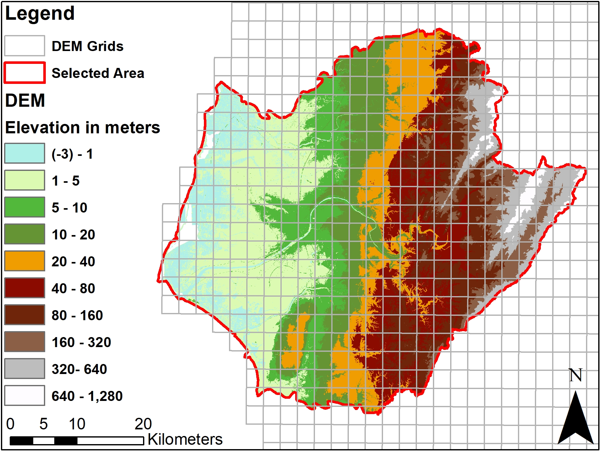

This is short python script for mergin multiple raster together.

<div class="content">
	<h3>Problem statment:</h3>
	<p>If we need to merge multiple rasters together we normally use <em>Mosaic To New Raster tool</em>.</p>
	<p>This function doesn't work well with a large number of datasets or if the final GeoTIFF is too large.</p>
	<p>Therefore, it's better to use a python script to do the hard work for us.</p>
	<p></p>
	<p>eg. In Taiwan, the DEM raster comes in multiple grid files together with a shapefile which includes the grid filenames</p>
	
		<figcaption>
			Figure 1: Raster grids
	    </figcaption>
	<h3>How I did it:</h3>
	<p>First I used the selected area shapefile to clip the grid shapefile.</p>
	<p>Second, I exported an attribute table, where each polygon has a <em>grid</em> field.</p>
	<p>In the last step, I built this small script which is based on the osgeo.gdal library.</p>
</div>
<div class="block">
Python script:
</div>
```python
from osgeo import gdal
import pandas as pd
import os

#read csv table 
files = pd.read_csv("table_from_shapefile.csv")
#take only grid column as it contains the name of files
filenames = files["grids"]

#make a list of filenames
demnames = []
for names in filenames:
    name = "Grid/"+str(names)+"DEM.tif"
    #check if file exists, if so, append to list
    if os.path.exists(name) == True:
         demnames.append(name)

#copy demnames
files_to_mosaic = demnames
g = gdal.Warp("output.tif", files_to_mosaic, format="GTiff",
              options=["COMPRESS=LZW", "TILED=YES"]) 

# Close file and flush to disk
g = None 
```

<div class="content">
	<h3>Results:</h3>
	<figure class="image is-320x240">
		
		<figcaption>
			Figure 2: Merged rasters
	    </figcaption>
	</figure>

</div>


