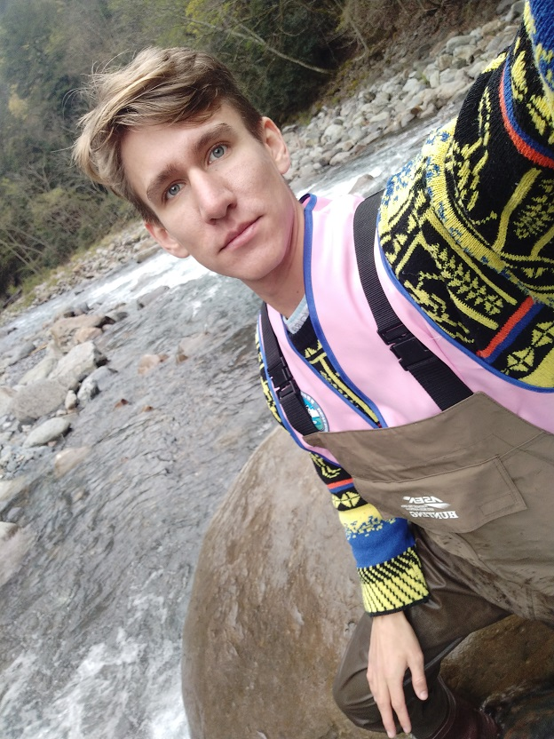

	

		<figure class="image is-3by4">
          
        </figure>
	

	

		
Hello! I’m Petr, and this is my personal website.

		
I am currently pursuing my PhD at the University of Padova in the Water Resources, Soil, and Watershed Protection Group at the Department of Land, Environment, Agriculture, and Forestry.

		
In the past, I spent two years working in Taipei City, Taiwan, as a research assistant at National Taiwan University, right after receiving my MSc degree in Natural Hazards Mitigation and Management from National Cheng Kung University (Taiwan) in 2020.

		
I’ve always been interested in everything related to water science and GIS. Recently, thanks to my work experience, I’ve also become passionate about remote sensing technology and Python programming.😃

		

		<h3>Here's my short CV</h3>
		

		    <h4>Working experience:</h4>
			<ul>
				<li>
					
 Oct 2023 - ongoing    	
						Università degli Studi di Padova (Italy)  
						PhD researcher 

				</li>
				<li>
					
 Feb 2023 - Sep 2023  	
						Novasole (Netherlands)  
						Geo data scientist 

				</li>
				<li>
					
 Sep 2020 - Jul 2022   	
						National Taiwan University (Taiwan)  
						University research assistant

				</li>
				<li>
					
 Jan 2019 - Jul 2020    	
						National Cheng Kung University (Taiwan)  
						University research assistant, Part-time

				</li>
			</ul>
			<h4>Academic Degrees:</h4>
			<ul>
				<li>
					
2020 
					National Cheng Kung University (Taiwan)  
					Master of Science – MSc.  
					International Master Program on Natural Hazards Mitigation and Management
					

				</li>
				<li>
					

					2018 
					Technical University of Ostrava (Czech Republic)  
					Engineer’s degree – Ing.  
					Engineering Safety of Persons and property 
					

				</li>
			</ul>
			<h4>Skills:</h4>
			<ul> PostGIS / PostgreSQL / Microsoft Azure / Agile Project Management / Git / Scrum / 
			Geographic Information Systems / ArcGIS / QGIS / HEC-RAS / 
			Python (Numpy, Scipy, Matplotlib, Pandas, Xarray, and scikit-learn libraries, Open3D) / 
			MicrosoftOffice / NodeXL / Gephi Software / Creating Static Sites with Jekyll
			</ul>
			
		

	

